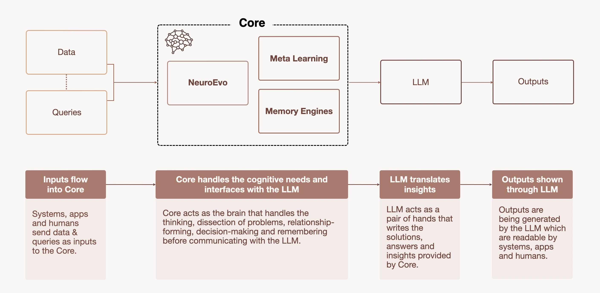

Agentic Core sits between inputs and LLMs. Core handles reasoning and cognition, LLMs handle output generation. LLMs are interchangeable. In Sandbox for example, you can swap models while retaining reasoning and learned pathways. There's less freedom for the time being on the Factory UI and API, though this can be enabled.

Both Core Abstract and Agentic Core run on the same Core intelligence. The difference is what's built around it.

|                       | Core Abstract                      | Agentic Core             |
| --------------------- | ---------------------------------- | ------------------------ |
| **What it is**        | Standalone cognitive engine        | Ready-to-use environment |
| **Who it's for**      | Developers building custom systems | Developers and end users |
| **How you access it** | Plug into your own infrastructure  | API or UI                |
| **Setup required**    | You build the environment          | Already configured       |

### Why Agentic Core exists

Not everyone wants to wire up their own infrastructure. Agentic Core takes the same Core intelligence and wraps it in an environment that's ready out of the box:

- **Developers** get API access to integrate Core into existing workflows without building everything from scratch
- **End users** get a UI where they can work with natural language agents without any technical setup

If Core Abstract is for teams who want full control over how Core fits into their stack, Agentic Core is for anyone who just wants to use it.

---

## How Core Works with LLMs

```
Inputs → Core → LLM → Outputs
```

### 1. Inputs flow into Core

Systems, apps, and humans send data and queries as inputs to the Core.

### 2. Core handles the cognitive needs and interfaces with the LLM

Core handles adaptive thinking, dynamic problem-solving, relationship discovery, pattern evolution, and predictive reasoning before communicating with interchangeable LLMs.

Inside Core:

| Component          | What it does                                                                                                                                                         |
| ------------------ | -------------------------------------------------------------------------------------------------------------------------------------------------------------------- |
| **Neuro Evo**      | Evolves pathfinding strategies through multidimensional concept spaces. Multiple navigation patterns compete and the most successful patterns merge over time.       |
| **MetaLearning**   | Discovers which reasoning approaches work best for different types of problems and automatically adjusts.                                                            |
| **Memory Engines** | Maintains multiple possible interpretations until context makes the best choice clear. Integrates information from different sources (text, code, time-series data). |

### 3. LLM translates insights

LLM writes the solutions, answers, and insights provided by Core.

### 4. Outputs shown through LLM

Outputs are generated by the LLM and returned to systems, apps, and humans.

---

## LLM Flexibility

Core handles reasoning. LLM handles output.

- Switch between language models while retaining reasoning and learned pathways
- Core's evolved strategies persist across different output models
- New LLMs can be integrated without retraining Core
