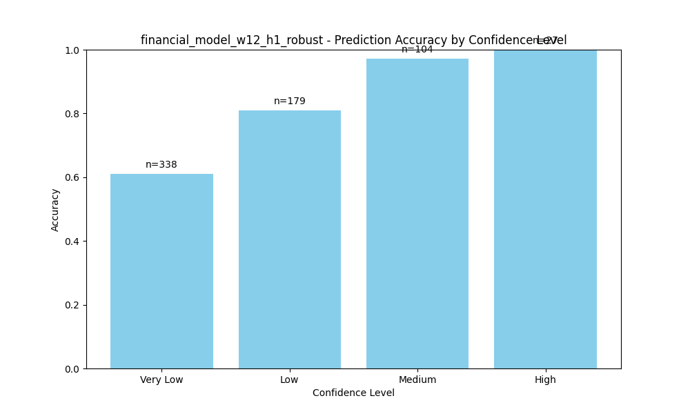
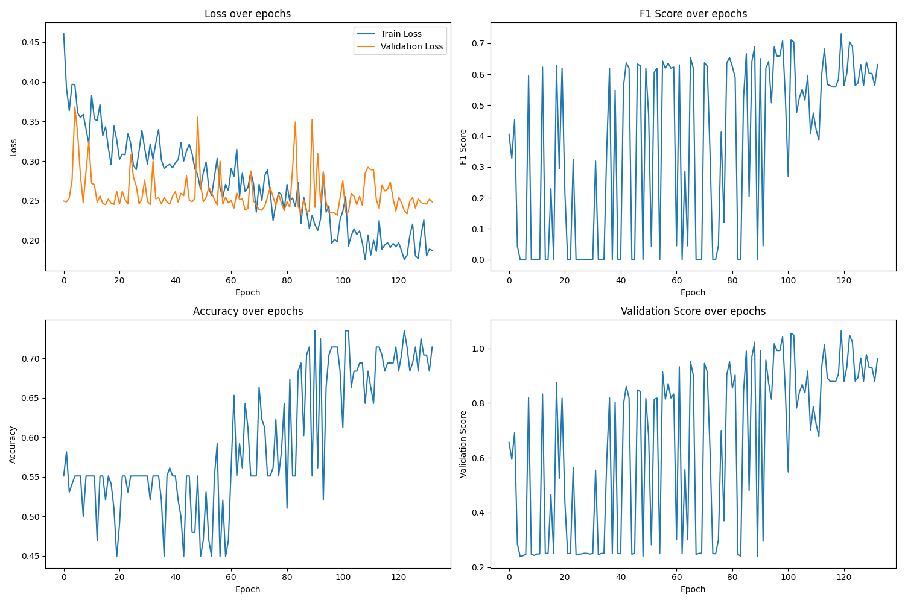
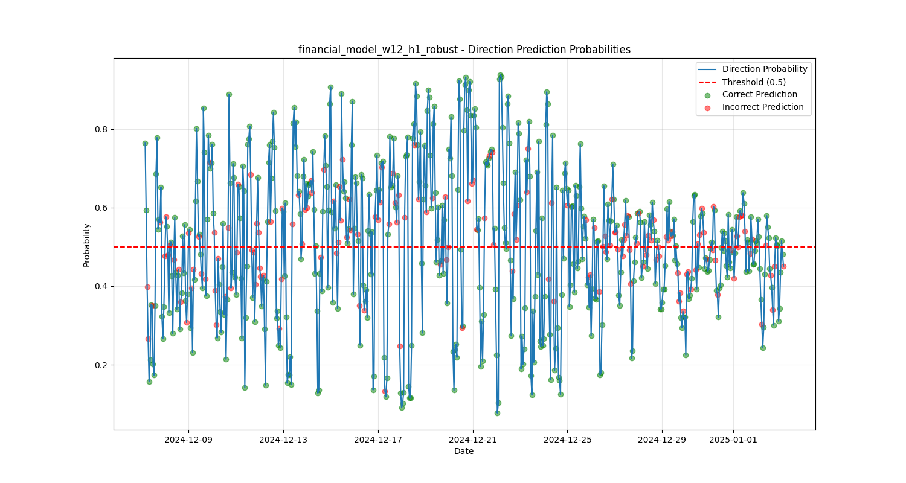

While the industry gravitates toward increasingly large models, our research has revealed that financial market prediction benefits from a more specialized, compact architecture. Hanabi-1 demonstrates how targeted design can outperform brute-force approaches in specific domains like financial time series analysis

With 16.4 million parameter model consists of:

* 8 transformer layers with multi-head attention mechanisms
* 384-dimensional hidden states throughout the network
* Multiple specialized predictive pathways for direction, volatility, price change, and spread
* Batch normalization rather than layer normalization for better training dynamics
* Focal loss implementation to address inherent class imbalance

The compact size enables faster inference times and allows us to deploy models at the edge for real-time decision making—critical for high-frequency market environments.

### Mathematical Foundations: Functions and Formulas <a href="#heading-mathematical-foundations-functions-and-formulas" id="heading-mathematical-foundations-functions-and-formulas"></a>

#### Positional Encoding <a href="#heading-positional-encoding" id="heading-positional-encoding"></a>

To help the transformer understand sequence ordering, we implement sinusoidal positional encoding:

$$PE(pos,2i) = \sin\left(\frac{pos}{10000^{2i/d_{model}}}\right)$$

$$PE(pos,2i+1) = \cos\left(\frac{pos}{10000^{2i/d_{model}}}\right)$$

Where `pos` is the position within the sequence and `i` is the dimension index.

#### Focal Loss for Direction Prediction <a href="#heading-focal-loss-for-direction-prediction" id="heading-focal-loss-for-direction-prediction"></a>

To address the severe class imbalance in financial market direction prediction, we implemented Focal Loss:

$$FL(p_t) = -(1-p_t)^\gamma \log(p_t)$$

Where `p_t` is the model's estimated probability for the correct class and `γ` is the focusing parameter (set to 2.0 in Hanabi-1). This loss function down-weights the contribution of easy examples, allowing the model to focus on harder cases.

#### Confidence Calibration <a href="#heading-confidence-calibration" id="heading-confidence-calibration"></a>

A key innovation in Hanabi-1 is our confidence-aware prediction system:

$$\text{Confidence} = 2 \cdot |p - \text{threshold}|$$

Where `p` is the predicted probability and `threshold` is our calibrated decision boundary (0.5). This allows users to filter predictions based on confidence levels, dramatically improving accuracy in high-confidence scenario.


*Confidence vs Accuracy*

As shown above, predictions with "High" confidence achieve nearly 100% accuracy, while "Very Low" confidence predictions are barely above random chance.

### Training Dynamics and Balanced Validation <a href="#heading-training-dynamics-and-balanced-validation" id="heading-training-dynamics-and-balanced-validation"></a>

Training financial models presents unique challenges, particularly the tendency to collapse toward predicting a single class. Our novel validation scoring function addresses this:

$$\text{ValScore} = F1 + 0.5 \cdot \text{Accuracy} + 0.5 \cdot PR_{\text{balance}} - 0.1 \cdot \text{Loss} - \text{Balance}_{\text{penalty}}$$

Where $PR_{\text{balance}}$ is the precision-recall balance metric:

$$PR_{\text{balance}} = \frac{\min(\text{Precision}, \text{Recall})}{\max(\text{Precision}, \text{Recall})}$$

And $\text{Balance}_{\text{penalty}}$ applies severe penalties for extreme prediction distributions:

```python
if precision == 0 or recall == 0:
    # Heavy penalty for predicting all one class
    balance_penalty = 0.5
elif precision < 0.2 or recall < 0.2:
    # Moderate penalty for extreme imbalance
    balance_penalty = 0.3
```

This scoring function drives the model toward balanced predictions that maintain high accuracy:


*Training dynamics*

The plot above reveals how training progresses through multiple phases, with early fluctuations stabilizing into consistent improvements after epoch 80.

### Model Architecture Details <a href="#heading-model-architecture-details" id="heading-model-architecture-details"></a>

Hanabi-1 employs a specialized architecture with several innovative components:

* **Feature differentiation through multiple temporal aggregations:**
  * Last hidden state capture (most recent information)
  * Average pooling across the sequence (baseline signal)
  * Attention-weighted aggregation (focused signal)
* **Direction pathway with BatchNorm for stable training:**
  * Three fully-connected layers with BatchNorm1d
  * LeakyReLU activation (slope 0.1) to prevent dead neurons
  * Xavier initialization with small random bias terms
* **Specialized regression pathways:**
  * Separate networks for volatility, price change, and spread prediction
  * Reduced complexity compared to the direction pathway
  * Independent optimization focuses training capacity where needed

The model's multi-task design forces the transformer encoder to learn robust representations that generalize across prediction tasks.

### Prediction Temporal Distribution <a href="#heading-prediction-temporal-distribution" id="heading-prediction-temporal-distribution"></a>


*Direction Probabilities*


The distribution of predictions over time shows Hanabi-1's ability to generate balanced directional signals across varying market conditions. Green dots represent correct predictions, and red dots are incorrect predictions.

### Performance and Future Directions <a href="#heading-performance-and-future-directions" id="heading-performance-and-future-directions"></a>

Current performance metrics:

* **Direction accuracy:** 73.9%
* **F1 score:** 0.67
* **Balanced predictions:** 54.2% positive / 45.8% negative

Hanabi-1 currently operates on two primary configurations:

* 4-hour window model (w4\_h1)
* 12-hour window model (w12\_h1)

Both predict market movements for the next hour, with the 12-hour window model showing superior performance in more volatile conditions.

Future developments include:

* Extending prediction horizons to 4, 12 and 24 hours
* Implementing adaptive thresholds based on market volatility
* Adding meta-learning approaches for hyperparameter optimization
* Integrating on-chain signals for cross-domain pattern recognition

### Conclusion <a href="#heading-conclusion" id="heading-conclusion"></a>

Hanabi-1 demonstrates that specialized, compact transformers can achieve remarkable results in financial prediction tasks. By focusing on addressing the unique challenges of financial data—class imbalance, temporal dynamics, and confidence calibration—we've created a model that delivers reliable signals even in challenging market conditions.

While the model can still be refined, we found that it’s a robust and important first step towards the definition and creation of even more capable financial models.

Follow the github repo for the current implementation and future upgrades:

[\
](https://github.com/0xReisearch/hanabi-1)
