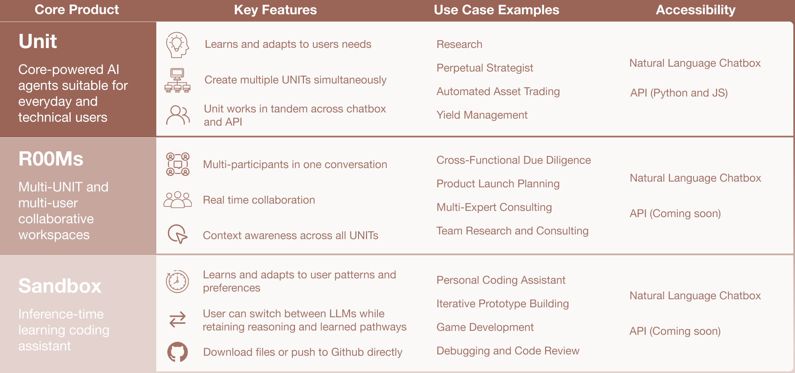

We built user-facing products on top of Core, targeting both technical and non-technical users. These products leverage Core's adaptive reasoning capabilities but do not expose Core as a standalone abstraction. For direct integration with Core, refer to the API documentation.

Three products are currently available: UNIT, R00Ms, and Sandbox.

---

## UNIT

Autonomous agents powered by Core's adaptive reasoning.

### Capabilities

| Feature                   | Description                                                                               |
| ------------------------- | ----------------------------------------------------------------------------------------- |
| Inference-time adaptation | Constructs reasoning pathways from interactions, improving performance over continued use |
| Multi-instance deployment | Run parallel UNITs for concurrent tasks                                                   |
| Cross-platform            | Consistent behavior across chat and API interfaces                                        |

### Applications

Research, strategic planning, automated trading, portfolio optimization.

### Access

- Chat
- API (Python, JS)

---

## R00Ms

Collaborative environments enabling multi-agent and multi-user coordination with shared context.

### Capabilities

| Feature                   | Description                                          |
| ------------------------- | ---------------------------------------------------- |
| Multi-participant         | Humans and UNITs operating within a single workspace |
| Synchronous collaboration | Real-time interaction across all participants        |
| Unified context           | Shared reasoning state across agents and users       |

### Applications

Cross-functional analysis, coordinated research, multi-domain consulting, team-based due diligence.

### Access

- Chat
- API _(coming soon)_

---

## Sandbox

Development environment with inference-time learning for code generation and iteration.

### Capabilities

| Feature                  | Description                                          |
| ------------------------ | ---------------------------------------------------- |
| Pattern acquisition      | Learns coding style and preferences through use      |
| Model-agnostic reasoning | Retains learned pathways when switching between LLMs |
| Direct integration       | GitHub push and file export built in                 |

### Applications

Rapid prototyping, debugging, code review, game development.

### Access

- Chat
- API _(coming soon)_

---

## Comparison

| Product | Primary Use       | Collaboration           | API         |
| ------- | ----------------- | ----------------------- | ----------- |
| UNIT    | Autonomous agents | Single-user             | Available   |
| R00Ms   | Team coordination | Multi-user, multi-agent | Coming soon |
| Sandbox | Development       | Single-user             | Coming soon |

---

## Getting Started

- **UNIT**: Personal AI agent for research, trading, or strategy
- **R00Ms**: Collaboration across teams or multiple agents
- **Sandbox**: Adaptive coding assistant for developers

:::info
All products accessible via chat interface. API availability varies by product.
:::
