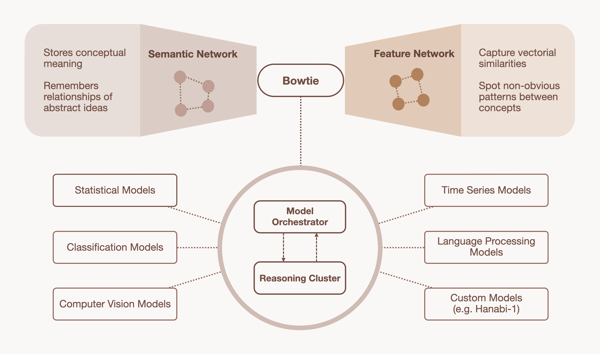

## Core

Core represents a fundamentally different approach to artificial intelligence, built on three interconnected pillars that redefine how AI systems process, understand, and evolve.

### Architecture Overview

Core's architecture consists of three key components working in harmony:

- **Bowtie Architecture** - Memory management and concept formation
- **Reasoning Cluster** - Synthetic brain for complex cognitive processes
- **Model Orchestration** - Intelligent task distribution across specialized models

---

### The Bowtie Architecture

_Rethinking Memory and Evolution_

#### Core Concept

The Bowtie Architecture is our proprietary system for memory management that processes information through three distinct components:

| Component      | Function                                                    |
| -------------- | ----------------------------------------------------------- |
| **Left Side**  | Semantic relationships and explicit connections             |
| **Center**     | Core concept distillation and fundamental elements          |
| **Right Side** | Vector similarity connections and abstract feature matching |

#### Dual Memory System

Information is stored in two complementary formats:

- **Semantic Vectors** - Preserve explicit meaning and relationships
- **Abstract Concept Nodes** - Strip away unnecessary text while maintaining essential vectorial features

#### Abstract Vectorial Features

The right side introduces completely detached vectorial features that can:

- Mix and match with vectorially-similar memories
- Create unexpected connections between unrelated concepts
- Identify latent properties through mathematical structure matching
- Enable creative leaps in understanding and problem-solving

#### Emergent Intelligence

When these networks interact through the bowtie's center, novel connections emerge organically. The system evolves and adapts over time, mimicking human cognition for genuine learning and discovery.

---

### The Reasoning Cluster

_The Heart of Core_

#### Primary Functions

The Reasoning Cluster serves as Core's synthetic brain, orchestrating cognitive processes through:

- **Decision Trees** - Identify optimal models for any query
- **Memory Creation** - Build memories using Bowtie architecture
- **Neural Connections** - Form links between concepts and ideas
- **Conceptual Graph** - Maintain and evolve knowledge relationships

#### Key Features

- **Sophistication Bias** - Ensures efficient and effective model selection
- **Parallel Processing** - Models work simultaneously for dynamic adaptation
- **Performance Standards** - Maintains high-quality output while adapting to new information
- **Transparency** - Provides clear reasoning paths for decision-making

---

### Model Orchestration

_Task Distribution_

#### System Overview

Core's orchestration system coordinates dozens of specialized models through:

- **Dynamic Query Decomposition** - Breaks complex problems into manageable components
- **Flexible Framework** - Plug-and-play integration for new models
- **Reduced Overhead** - Optimizes computational efficiency

#### Specialized Model Categories

**Statistical Models**

- Numerical prediction
- Classification tasks
- Time series analysis

**Perception Models**

- Visual processing
- Audio processing
- Sensor data interpretation

**Domain-Specific Models**

- Industry-specific applications
- Specialized task handling
- Custom problem-solving

#### Performance Optimization

The orchestration layer continuously:

- **Analyzes Queries** - Determines required cognitive functions
- **Routes Tasks** - Directs work to appropriate models
- **Monitors Performance** - Maintains detailed profiles and metrics
- **Allocates Resources** - Ensures optimal system efficiency

---

### Technical Benefits

#### Memory Efficiency

- Intelligent information compression
- Dual representation system
- Eliminates redundant data storage

#### Cognitive Flexibility

- Cross-domain knowledge transfer
- Creative problem-solving capabilities
- Adaptive learning mechanisms

#### Scalable Architecture

- Modular model integration
- Dynamic resource allocation
- Performance-based optimization

---

### How Core Works Together

1. **Input Processing** - Bowtie Architecture processes and stores information
2. **Query Analysis** - Reasoning Cluster determines optimal approach
3. **Task Distribution** - Model Orchestration routes work to specialized models
4. **Memory Integration** - Results feed back into evolving knowledge system
5. **Continuous Learning** - System adapts and improves over time

This integrated approach creates a living, breathing AI system that continuously develops and refines its understanding while maintaining high performance and efficiency.
