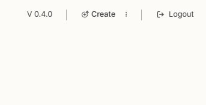
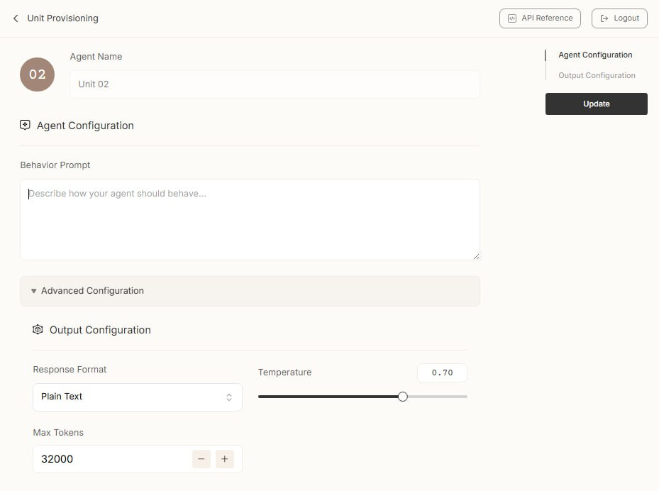
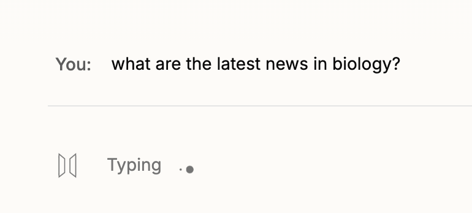
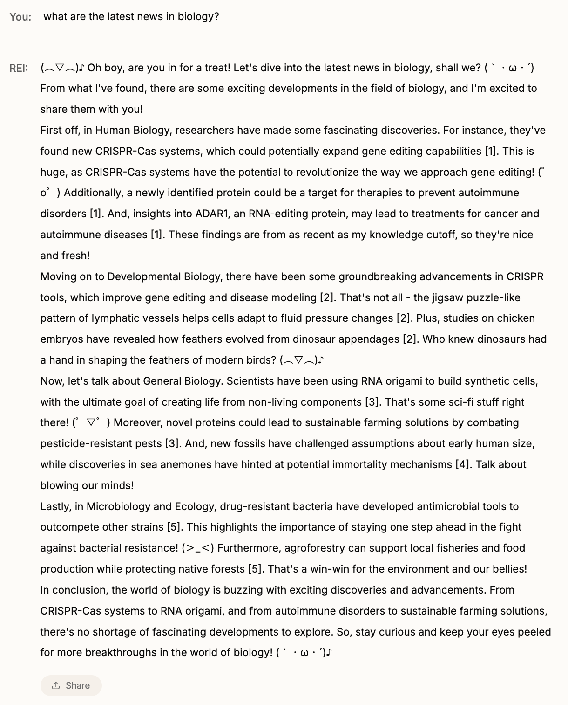
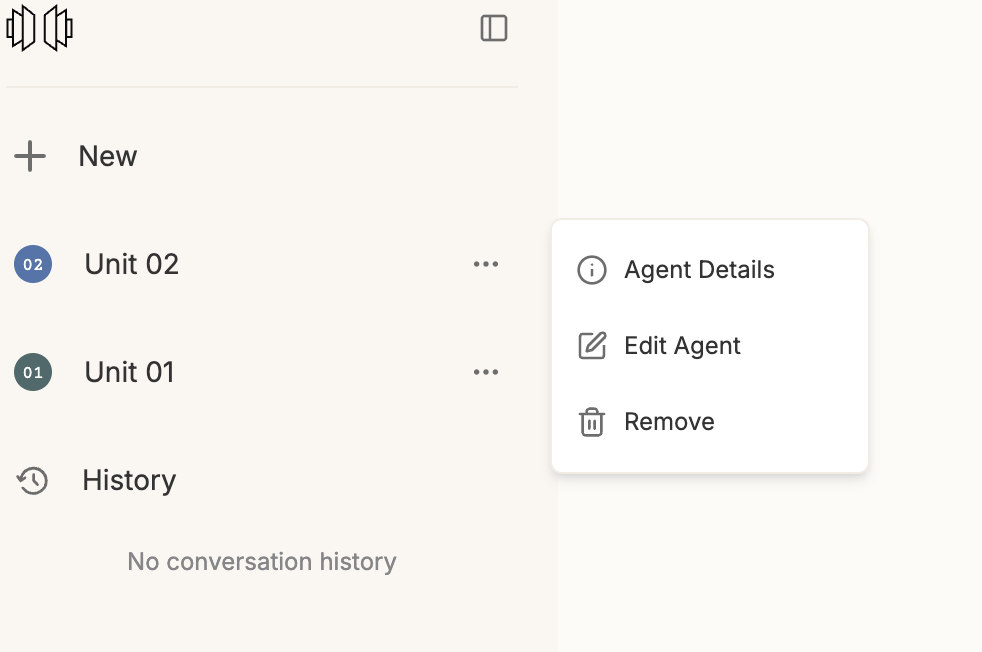

By visiting (Closed Beta Testers only) You will land on the factory's interface\
Click on Create at the top right to start.

Here you can start the customization of your agent. The name is fixed and progressive across all users.

**Behavior Prompt** is used to give an initial imprint to your agent: specialized units perform better at their task from the start, compared to broad use agents that needs time and interactions to "learn".\
Select the Text Engine you desire, temperature and Max Tokens (those 2 parameters only reflects on the "freedom of expression" of the text engine).

**Response** is relevant only for API use and it determines how you like to get your response: soon you'll be able to get just structured data as an answer, to seamlessly integrate your agent in your applications with a defined schema.

Click Create again and your agent is ready to answer you.

You can modify the behavior and the other parameters clicking on the left sidebar, three dots next to the target unit, Edit Agent

