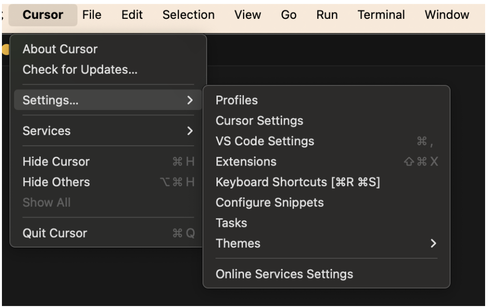
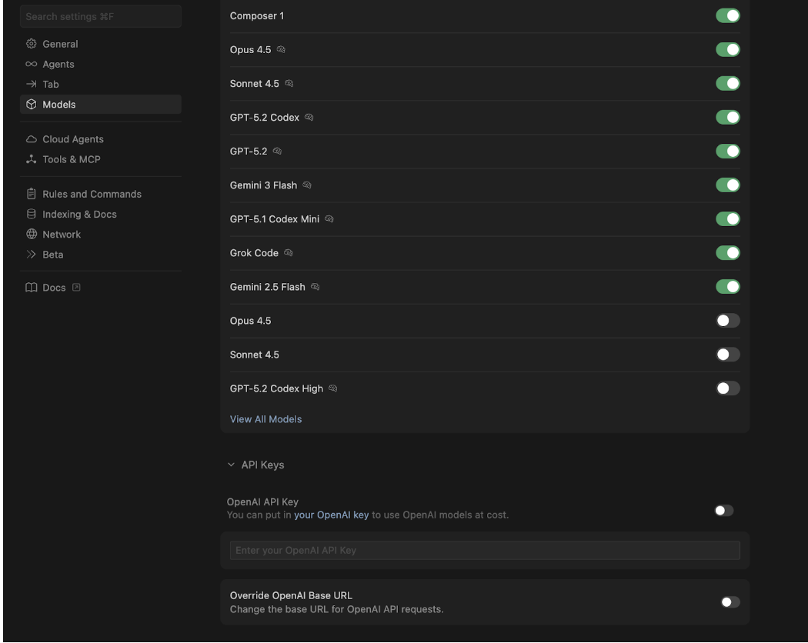
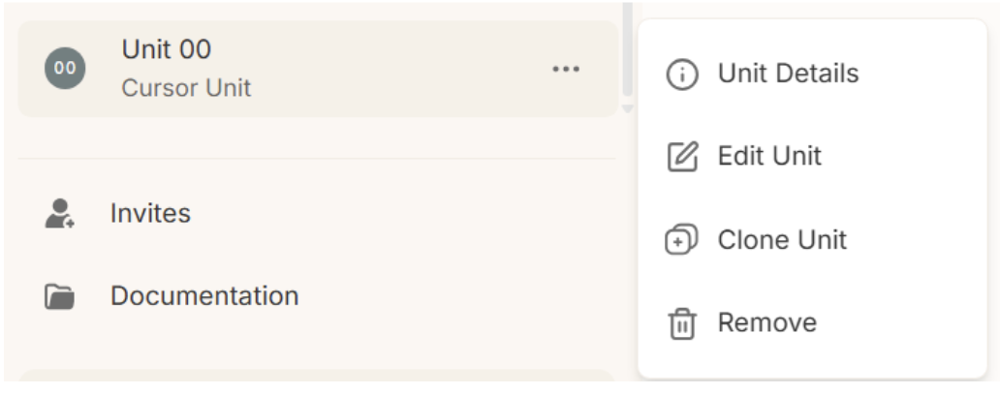
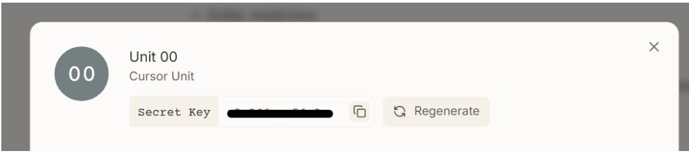
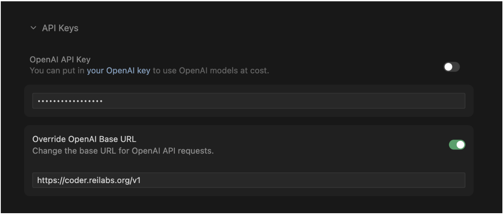
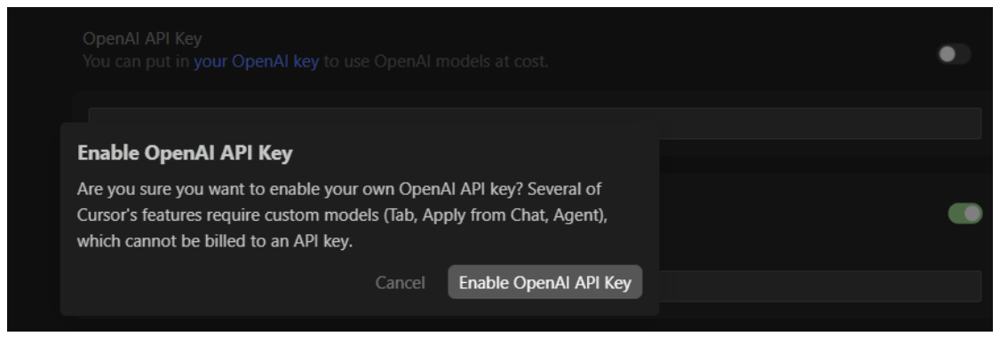
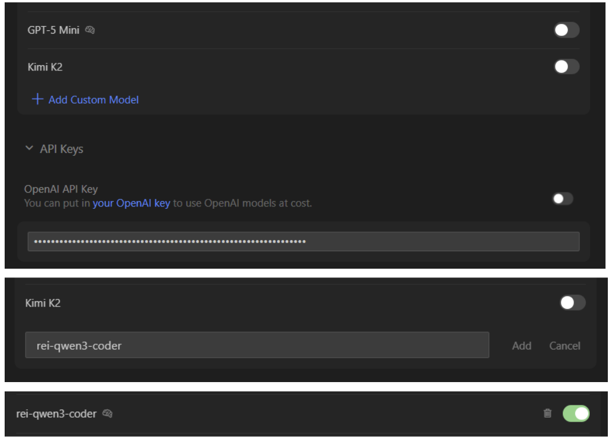
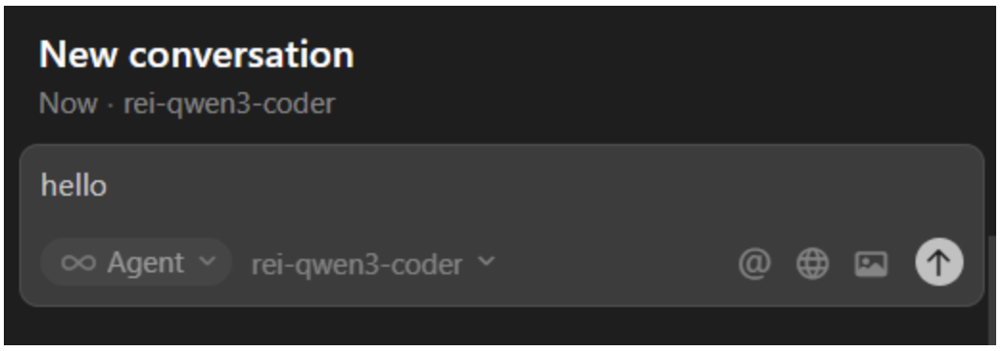

Before starting please note that Cursor enforces plan-based restrictions on certain model integrations. Users on free or lower-tier plans may encounter an "Invalid Model" error when attempting to add Custom Models, even with correct API settings.

## Open Settings

Launch Cursor and head to Settings > Cursor Settings

## Access Model Configuration

Go to Models → Expand the API Keys section.

## Enter Your Rei Unit Secret Key

This is located in Unit Details -> Secret Key. Do not share this to anyone

In the OpenAI Key field, input your Rei Unit Secret Key.

## Override API Endpoint

Set the OpenAI API URL to: https://coder.reilabs.org/v1
Enable the Override OpenAI Base URL button

## Enable the API Key

Turn on the OpenAI API key button to start and activate the connection

## Add Custom Model Name

In the Model section go to Add Custom Model field and enter: rei-qwen3-coder

## Save and Test

Save the settings and open a new chat or code task to verify it loads correctly. Ensure the rei-qwen3-coder is selected as the model.

